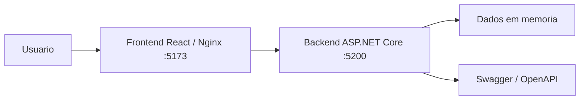

# Arquitetura

## Visao geral

O OrbitBoard e uma aplicacao full stack didatica para acompanhamento de projetos, tarefas e equipe. A solucao foi mantida com dados em memoria para concentrar o trabalho na integracao HTTP/JSON, configuracao de ambiente e execucao em containers.

## Camadas

| Camada | Tecnologia | Responsabilidade |
|---|---|---|
| Front-end | React 18, Vite, React Router | Renderizar telas, formularios, filtros e estados de carregamento, sucesso e erro. |
| Back-end/API | ASP.NET Core 8 Web API | Expor endpoints REST, validar entradas, aplicar regras simples e retornar JSON. |
| Dados | Servico em memoria | Guardar projetos, tarefas e integrantes enquanto a API esta em execucao. |
| Infraestrutura | Docker, Docker Compose, Nginx | Construir e executar front-end e back-end com portas e variaveis documentadas. |

## Fluxo de integracao

1. O usuario acessa o front-end em `http://localhost:5173`.
2. O React usa `VITE_API_URL` para chamar a API em `http://localhost:5200`.
3. A API responde em JSON e trata erros com `ProblemDetails`.
4. O front-end interpreta sucesso, erro e carregamento para atualizar a interface.

## Diagrama

